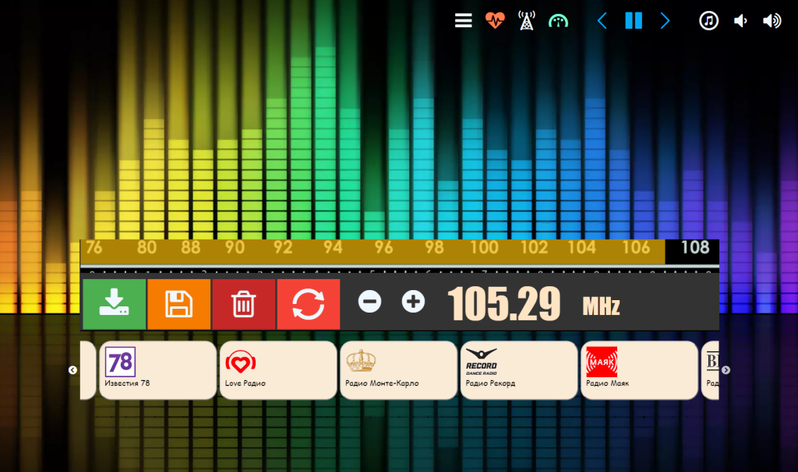
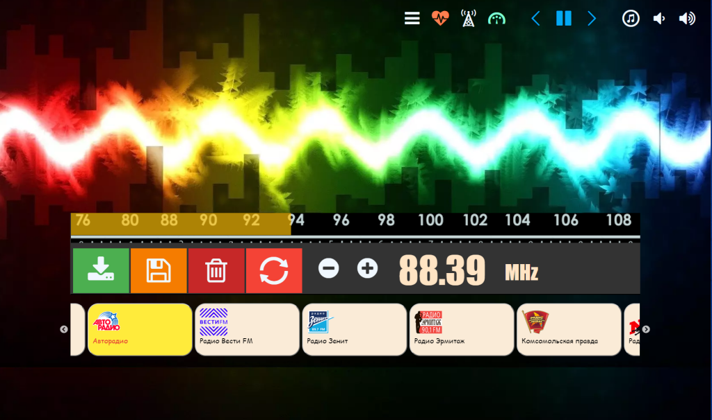
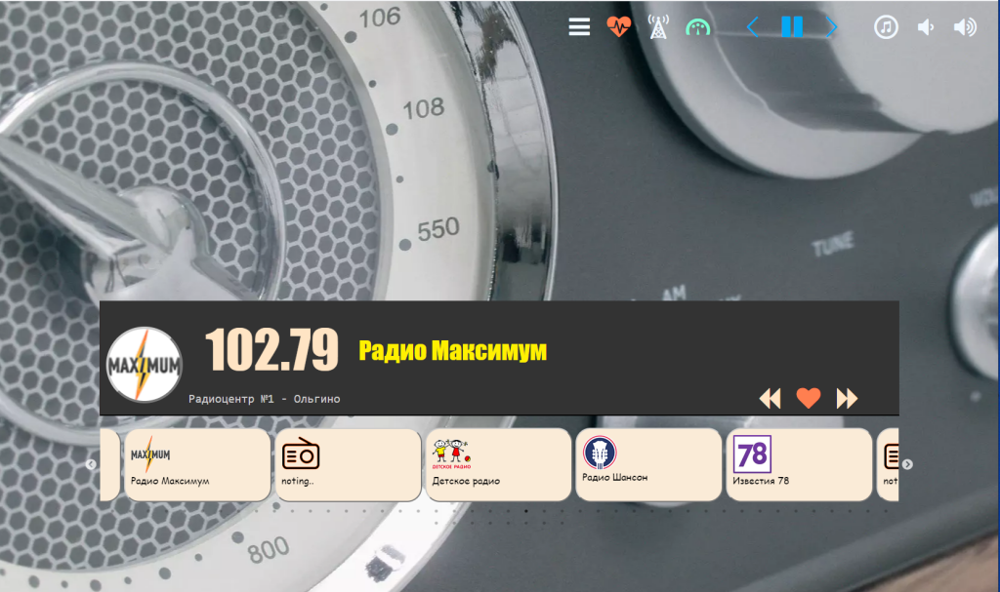

# My FM Radio (ESP8266 + TEA5767/RDA5807M/SI470x)

---

My FM Radio ESP8266 + (TEA5767/RDA5807M/SI470x) WebSocket interface

## Required:

library https://github.com/mathertel/Radio implements the functions to control the FM radio receiver chips:  
* The RDA5807M from RDA Microelectronics.  
* The TEA5767 from NXP.  
* The SI4703 from Silicon Labs.  
* The SI4705 from Silicon Labs.  

## ScreenShot:

  

  

  

  

---

